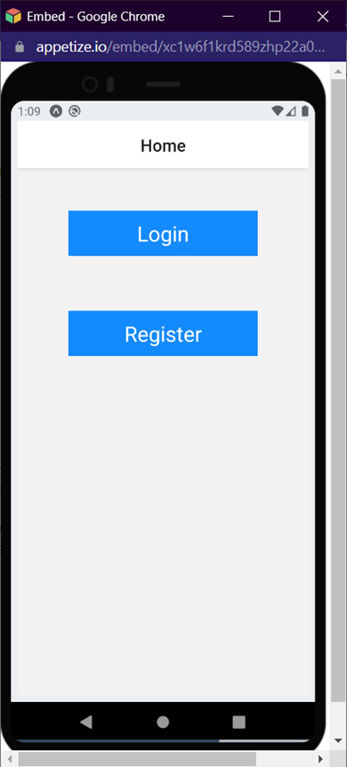
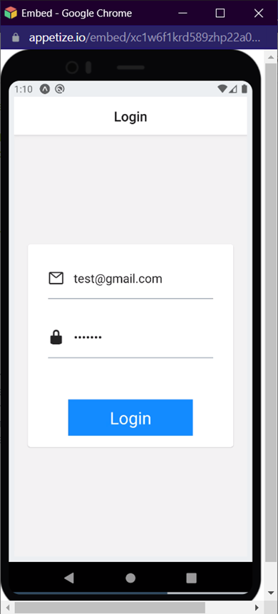
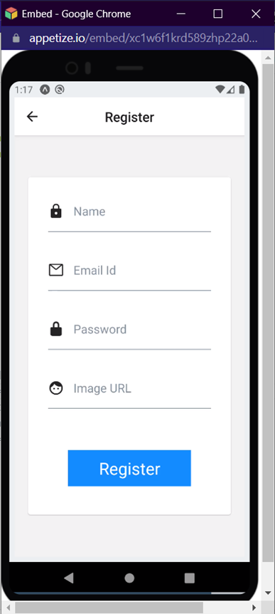
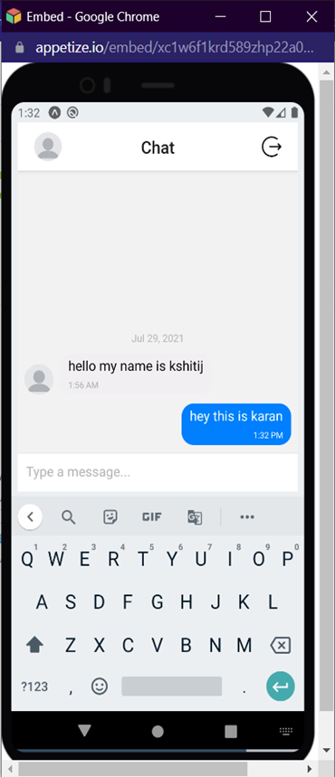

# Chathub 📲📲

****

## My Goal

****
The objective of this project was to build a chat application using Javascript, React-Native, Firebase Authentication &
Firebase Cloud Database. The application gives the functionality of sign-in, sign-up and a chat room. The chat room is
created by using `react-native gifted chat` library which allows users to send text messages as well as images.

## What I have created

****

